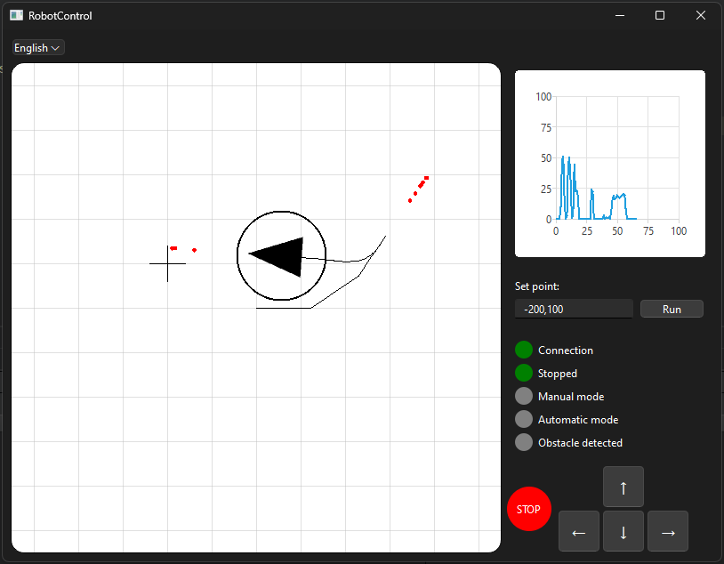

# DiffSight Project Overview

## Description
This project is a Qt application designed to visualize sensor data and control certain functionalities of a differential drive robot (https://github.com/Rooteq/DiffDrive) through a user-friendly interface. The primary components of the project include graphical widgets for displaying charts, interactive elements such as buttons, and language support for multi-lingual users.

## Key Features
- **Velocity Chart:** Displays real-time velocity data calculated from sensor inputs.
- **Graphics Utilities:** Custom graphics items are used for visualization including lines, crosses, and dots.
- **LED Widgets:** Indicates robot's internal statuses using LED-like labels.
- **Set Destination:** Allows users to input coordinates for setting a point.
- **Language Support:** Enables switching between multiple languages to cater to diverse user bases.
- **Control arrows:** Provides a simple interface for controlling the robot.

## Interface look
The final interface looks like this:
